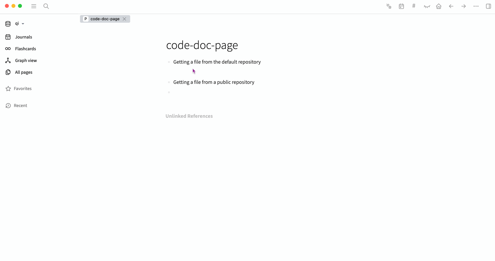

# Embed code from a Github repository into a logseq block

## Overview

This plugin allows the user to easily import the contents of files from any Github repository that the Github user has access to.
The main goal is to enhance the ability to document code development and final code using [Logseq](https://docs.logseq.com).

## Suggested Use

Create a new logseq graph in the root of your code repository under a `\docs` folder.
The logseq Journal can be used to document the day-by-day development progress.
As code is developed and pushed to Github, the code can be retrieved and inserted into a Logseq page block using this plugin.
The code can then be documented using Logseq's extensive note taking capabilities.

As a code file is updated and the changes pushed to Github, the code in Logseq can be immediately updated to the latest version using the `refresh` icon at the top of the code block.

## Example

This example shows how to embed a file from a repository which is synced to Github. The repository is cloned locally and open in VS Code. The Github account name and repository name have been entered in the plugin settings as default, so only the relative path of the file needs to be entered.

## One-Time Configuration

1. Ensure you are running [logseq version 0.6.5](https://github.com/logseq/logseq/releases) or later.
2. Open the logseq settings menu.
3. Select `Plugin Settings` and click on the `logseq-plugin-github-get` tab.
4. _Required_: Enter a personal access token with full repository access rights in the field labeled `githubPat`. For more information on how to generate a personal access token, look [here](https://docs.github.com/en/authentication/keeping-your-account-and-data-secure/creating-a-personal-access-token).
5. Optional: Enter the default github account name that your repository resides in. Use your `username` (not your email address) in the field labeled `githubAccount`. If this is left empty you must provide the account for every repository file that you wish to retrieve. See the section `Running the Github Command` below for the correct URL to use.
6. Optional: Enter the name of the repository where your files reside. If this is left empty you must provide the account for every repository file that you wish to retrieve. See the section `Running the Github Command` below for the correct URL to use.

## Using Logseq as a code documentation tool

1. Open the local version of the repository that you want to document within your IDE (VS Code is used in the example given above).
2. Create a root directory called `docs`.
3. Open Logseq and select `Add a graph` from the left sidebar graph menu item.
4. Navigate to the docs `folder` that you have just created.
5. Use Logseq to document your development process.
6. When you are ready to document specific code in the repository, follow the per-file to embed process described below.

## Running the Github Command

### Using with files in the default repository

1. Ensure that the account name and the repository name are provided in the plugin settings. See the `One-Time Configuration` section above.
2. Ensure that the file is pushed to your Github repository. The plugin will retrieve the most recent version of the file. (A later version of this plugin will allow you to get a specific commit version of the file)
3. Select the file within your IDE that you wish to embed within LogSeq.
4. Copy the relative path of the file from the root of the local copy. (You can obtain this in VS Code by right-clicking on the file in the Explorer and selecting `Copy Relative Path` from the context menu).
5. Select an empty block in LogSeq where you want to import the file. Paste the relative path of the file. e.g. `src/package.json`
6. Run the `Get Github File` command by entering `/Get Github File` after the file path.
7. If the configuration and file path are correctly entered the code should appear immediately below the selected block.

### Using with files in another Github repository and/or account

Step 4 should be amended as follows:

1. If the file is not in the default repository, enter the name of repository, followed by a double-colon '::', before the relative path. e.g. `another-repo:src/package-json`
2. If the file is not in the default account nor the default repository, enter the name of the account, followed by '?', the name of the repository, followed by a colon ':', before the relative path. `another-account::yet-another-repo:src/package.json`

The general URL format is `<account name>::<repository name>?<relative filepath>`

## Refreshing the code

1. Once a file has been retrieved frm Github the block's parent shows the filename, the commit id, and a `refresh` icon. To retrieve the latest version of the code simply click on the filename or the `refresh` icon. **NOTE** This will overwrite the existing version of the code.
2. To guard against accidental refresh, click on the commit id. This will toggle a `pin` icon. When the pin icon is visible the refresh button is disabled.
3. To re-enable refresh, click the commit id again. The pin icon will disappear.

## Installing the Plugin Manually

1. Clone the [plugin repo](https://github.com/mandpd/logseq-plugin-github-get) to a local folder.
2. In logseq, open `Logseq→Settings`, enable developer mode.
3. Open `Logseq→Plugins`, choose `Load unpacked plugin`, and select the location where you saved the source code.
4. Follow the configuration steps given above.
5. The `Get Github File` command should now be installed and active.

## Supported file types

The following file types will be recognized and the appropriate code parser selected for the code block - typescript, javascript, html, php, markdown, Jupyter python notebooks, julia, R Python, YAML, docker, and typescript react.
